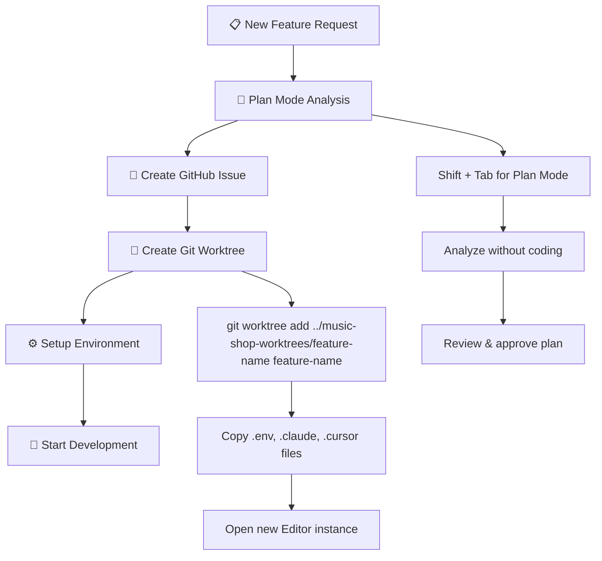
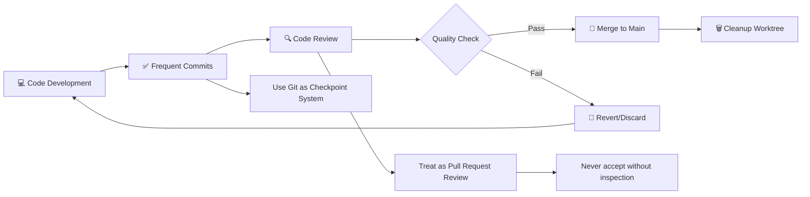
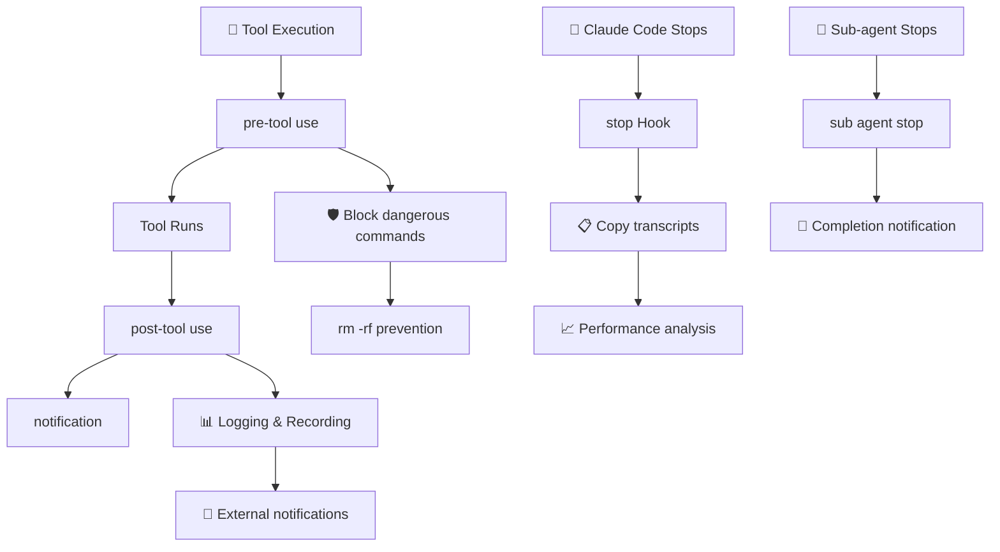
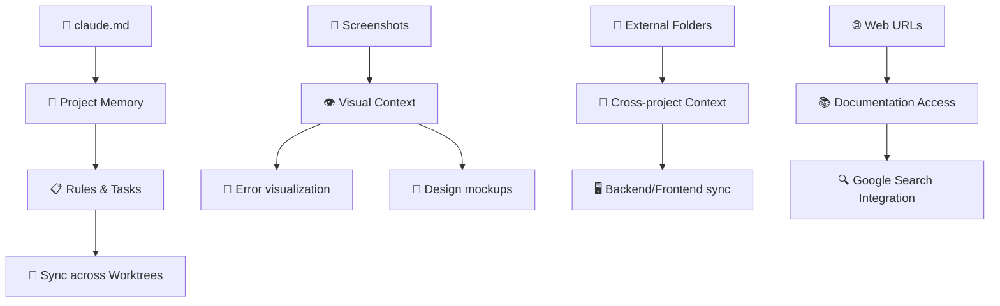
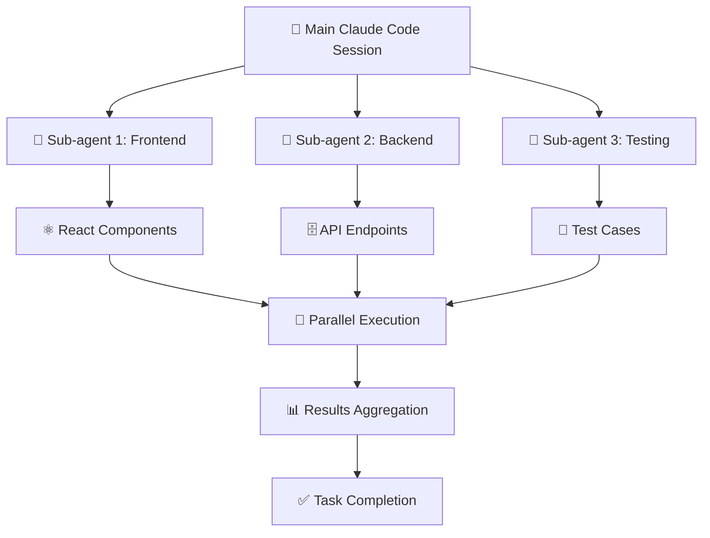
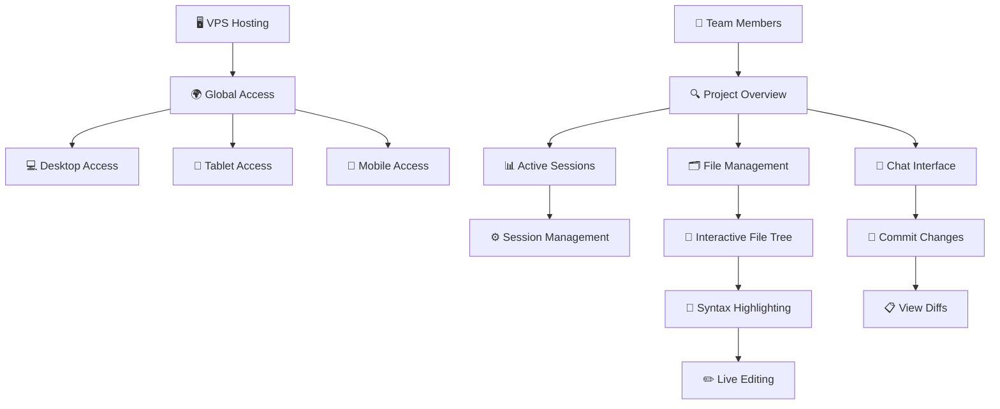
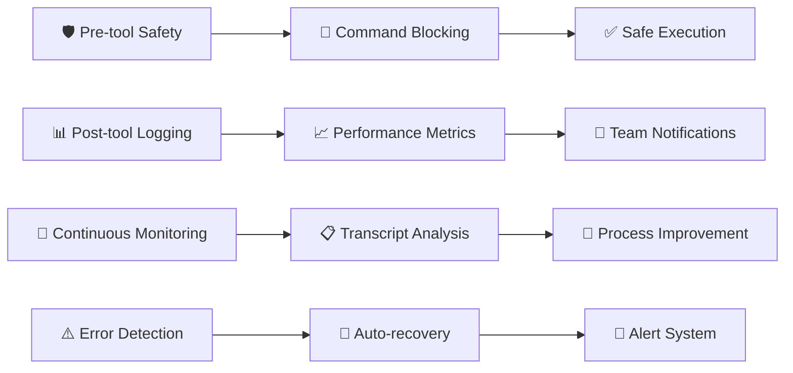

# Claude Code Team Development Workflow

## 🏗️ Initial Setup & Project Structure

```
📁 Project Root
├── 📁 music-shop/                    # Main project directory
│   ├── 📄 claude.md                  # Claude's "brain" - project memory
│   ├── 📁 .claude/                   # Claude Code settings
│   ├── 📁 .cursor/                   # Cursor settings
│   ├── 📄 .env                       # Environment variables
│   └── 📄 settings.json              # Hooks configuration
└── 📁 music-shop-worktrees/          # Worktrees directory (parallel to main)
    ├── 📁 feature-authentication/
    ├── 📁 feature-payment/
    └── 📁 feature-dashboard/
```

## 🔄 Core Workflow Process

### Phase 1: Planning & Setup


### Phase 2: Development Cycle


## 🛠️ Advanced Features Integration

### Git Worktrees Management
```
# Create new worktree with automation script
WT feature-name

# Script automatically:
✅ Creates worktree and branch
✅ Opens new editor window
✅ Copies essential files (.env, .claude, .cursor)
✅ Sets up Claude Code instance
```

### Claude Code Hooks System


### Context Management


## 🎯 Parallel Development Strategy

### Multi-Session Management
```
Session 1: Authentication Feature
├── 📁 music-shop-worktrees/feature-auth/
├── 💻 Cursor Instance #1
├── 🖥️ Terminal #1
└── 🤖 Claude Code Instance #1

Session 2: Payment Integration
├── 📁 music-shop-worktrees/feature-payment/
├── 💻 Cursor Instance #2
├── 🖥️ Terminal #2
└── 🤖 Claude Code Instance #2

Session 3: Dashboard UI
├── 📁 music-shop-worktrees/feature-dashboard/
├── 💻 Cursor Instance #3
├── 🖥️ Terminal #3
└── 🤖 Claude Code Instance #3
```

### Sub-agents for Complex Tasks


## 🌐 Claude Code UI Integration

### Remote Access & Collaboration


## 📊 Quality Assurance & Monitoring

### Safety & Control Measures


### Issue Tracking Integration
```mermaid
graph TD
    A[📋 GitHub Issues] --> B[🎯 Custom Slash Commands]
    B --> C[/plan Command]
    C --> D[📝 Automatic Issue Creation]
    
    E[🔗 Issue Linking] --> F[🌿 Branch Association]
    F --> G[📊 Progress Tracking]
    G --> H[✅ Auto-close on Merge]
    
    I[🏷️ Labels & Milestones] --> J[📈 Sprint Planning]
    J --> K[👥 Team Assignment]
    K --> L[⏰ Timeline Management]
```

## 🎯 Best Practices Summary

### ✅ Do's
- 📋 **Always start with Plan Mode** (Shift + Tab)
- 🔄 **Commit frequently** as checkpoints
- 👀 **Review all AI-generated code** thoroughly
- 🗂️ **Use separate worktrees** for parallel development
- 📱 **Provide rich context** (screenshots, URLs, folders)
- 🎯 **Leverage custom slash commands** for efficiency
- 📊 **Monitor and measure** performance with hooks

### ❌ Don'ts
- 🚫 **Don't work on same branch** simultaneously
- 🚫 **Don't accept changes** without review
- 🚫 **Don't skip planning phase** for speed
- 🚫 **Don't ignore safety measures** (pre-tool hooks)
- 🚫 **Don't create worktrees** inside main project
- 🚫 **Don't forget to sync** claude.md across worktrees
- 🚫 **Don't skip transcript analysis** for improvement

## 🚀 Automation Scripts

### Worktree Creation Script (WT)
```bash
#!/bin/bash
# WT - Worktree automation script

FEATURE_NAME=$1
WORKTREE_DIR="../music-shop-worktrees/$FEATURE_NAME"

# Create worktree and branch
git worktree add $WORKTREE_DIR $FEATURE_NAME

# Copy essential files
cp .env $WORKTREE_DIR/
cp -r .claude $WORKTREE_DIR/
cp -r .cursor $WORKTREE_DIR/
cp claude.md $WORKTREE_DIR/

# Open new editor instance
cursor $WORKTREE_DIR &

echo "✅ Worktree '$FEATURE_NAME' created and ready!"
```

### Cleanup Script
```bash
#!/bin/bash
# Cleanup completed worktrees

FEATURE_NAME=$1
WORKTREE_DIR="../music-shop-worktrees/$FEATURE_NAME"

# Remove worktree
git worktree remove $WORKTREE_DIR

# Delete branch (optional)
git branch -d $FEATURE_NAME

echo "🗑️ Worktree '$FEATURE_NAME' cleaned up!"
```

---

## 📈 Success Metrics

- 🎯 **Reduced conflicts** through parallel development
- ⚡ **Faster development** with AI assistance
- 🔍 **Better code quality** through systematic review
- 👥 **Improved team collaboration** with shared workflows
- 📊 **Enhanced visibility** through monitoring and logging
- 🛡️ **Increased safety** with automated guards and checks